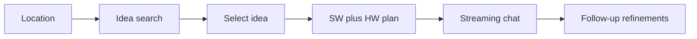

# Locality Idea Search + Build Assistant (Web MVP)

Greenfield app in this empty repo: a location-aware idea finder plus an AI chat that produces **software architecture** and **hardware BOM/build plans** for a chosen idea.

## Product flow

1. User shares a city/region (detect via browser geolocation, or type a place).
2. App reverse-geocodes and loads **local context**: place name, region, plus nearby resources (makerspaces, electronics stores, fab labs) when available.
3. LLM returns ranked **ideas** tied to local problems/opportunities and what can realistically be built nearby.
4. User opens an idea and gets a structured **build brief** (problem, software stack, hardware BOM, steps, local resource notes).
5. Chat stays scoped to that idea: follow-ups, regenerate sections, new chats, persisted history.

Out of MVP: accounts, voice, file/image upload, regenerate-from-message-id, payment, legal-compliance engine.

## Stack

- **[Next.js](https://nextjs.org/) (App Router) + TypeScript + Tailwind** in the current workspace root.
- **Server routes** for geocoding, resource lookup, idea search, and chat streaming (API keys stay on the server).
- **LLM**: OpenAI-compatible API (`OPENAI_API_KEY`, optional `OPENAI_BASE_URL` / `OPENAI_MODEL`) so OpenAI, Groq, or similar can be swapped.
- **Persistence**: `localStorage` for chats and last location (no auth). Optional later: SQLite.
- **Maps/geo (free, no key for MVP)**:
  - [Nominatim](https://nominatim.org/) for geocode/reverse-geocode (respect usage policy; cache results).
  - [Overpass API](https://wiki.openstreetmap.org/wiki/Overpass_API) for nearby `makerspace`, `hackerspace`, `electronics`, `hardware` shops (timeout + graceful fallback if OSM is empty).

## App structure

Create roughly:

- [`app/page.tsx`](app/page.tsx) — location input, “Use my location”, idea results.
- [`app/ideas/[id]/page.tsx`](app/ideas/[id]/page.tsx) — idea brief + chat panel (or split layout).
- [`app/api/locality/route.ts`](app/api/locality/route.ts) — geocode + OSM resources.
- [`app/api/ideas/route.ts`](app/api/ideas/route.ts) — LLM idea list (JSON).
- [`app/api/chat/route.ts`](app/api/chat/route.ts) — SSE streaming chat with idea + locality context.
- [`lib/prompts.ts`](lib/prompts.ts) — system prompts for ideas vs build-plan chat.
- [`lib/chat-store.ts`](lib/chat-store.ts) — client history (threads, messages, active idea).
- [`components/Chat.tsx`](components/Chat.tsx) — messages, composer, stop, new chat, streaming token display, markdown/code blocks.

## Feature details

**Locality**

- Browser `navigator.geolocation` with permission prompt; fallback city search.
- Store `{ lat, lon, label, country }` and pass into all LLM calls.
- Resource list: name, type, distance (haversine), OSM tags. If Overpass fails, still generate ideas from place name + a “resources unknown” note.

**Idea search**

- Request JSON: `id`, `title`, `localProblem`, `whyHere`, `softwareSketch`, `hardwareSketch`, `difficulty`, `suggestedResources[]`.
- UI: cards filterable by software-only / hardware-only / mixed.
- Ideas are generated (not a static catalog); cache last search in session so refresh does not re-hit the LLM immediately.

**Build brief + chatbot**

- First assistant message after selecting an idea: structured plan (problem, architecture, BOM with quantities, software modules, phased steps, local sourcing tips, safety/regulatory **disclaimer**).
- Chat MVP: streaming, stop generation, new chat, thread list, follow-ups that keep idea + locality in the system prompt.
- Safety: refuse weapons/illegal manufacturing; hardware plans stay hobby/prototype level.

## Env and run

- `.env.local.example`: `OPENAI_API_KEY`, `OPENAI_MODEL`, `OPENAI_BASE_URL`.
- README: how to run (`npm install`, `npm run dev`), how location + OSM work, that idea quality depends on the model.

## Verification

- Manual: detect location, typed city, empty OSM fallback, idea cards, open idea, stream a plan, follow-up, new chat, history after reload.
- No browser MCP guaranteed in this workspace; verify with `npm run dev` plus curl on `/api/ideas` and `/api/chat` if UI tools are unavailable.
